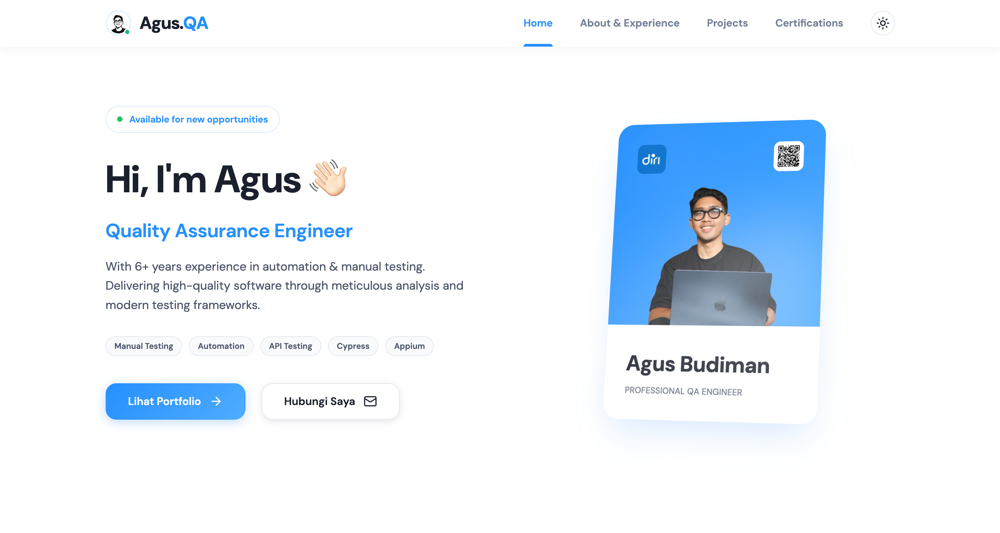

# 🧪 Agus Budiman — QA Engineer Portfolio

A modern, responsive personal portfolio website built with **React + TypeScript + Vite**, showcasing my experience, projects, skills, and certifications as a QA Engineer.

🌐 **Live Site:** [portfolio-qa-agus.vercel.app](https://portfolio-qa-agus.vercel.app/) 

---

## ✨ Features

- 🎨 **Dark / Light Mode** — Toggle between themes with smooth transitions
- 📱 **Fully Responsive** — Optimized for mobile, tablet, and desktop
- 🚀 **Smooth Animations** — Powered by Framer Motion
- 📄 **Multiple Pages** — Home, About, Projects, and Certifications
- 💬 **Endorsements** — Real testimonials from colleagues and managers
- 🛠️ **Skills & Tools** — Visual showcase of tech stack and QA tools
- 📩 **Contact Section** — Direct email and social links
- 📋 **Downloadable CV** — PDF resume available for download

---

## 🛠️ Tech Stack

| Category       | Technology                        |
|----------------|-----------------------------------|
| Framework      | React 19                          |
| Language       | TypeScript                        |
| Build Tool     | Vite                              |
| Routing        | React Router DOM v7               |
| Animations     | Framer Motion                     |
| Icons          | Lucide React                      |
| Styling        | Vanilla CSS (CSS Custom Properties) |

---

## 📁 Project Structure

```
qa-portfolio/
├── public/
│   ├── assets/             # Static assets (CV PDF)
│   ├── img/                # Images (profile, company logos, tools, certs)
│   └── favicon.ico
├── src/
│   ├── components/
│   │   ├── Home/           # Hero, WorkExperienceTimeline, FeaturedProjects, etc.
│   │   ├── Layout/         # Navbar, Footer
│   │   └── common/         # Reusable: Button, Badge, ProjectCard, SectionHeader
│   ├── context/
│   │   └── ThemeContext.tsx # Dark/Light mode provider
│   ├── data/               # JSON data files (experience, projects, certs, etc.)
│   ├── pages/              # Home, About, Projects, Certifications
│   ├── App.tsx
│   ├── main.tsx
│   └── index.css
├── index.html
├── package.json
├── tsconfig.json
└── vite.config.ts
```

---

## 🚀 Getting Started

### Prerequisites

- **Node.js** v18+ 
- **npm** v9+

### Installation

```bash
# 1. Clone the repository
git clone https://github.com/your-username/qa-portfolio.git

# 2. Navigate to the project directory
cd qa-portfolio

# 3. Install dependencies
npm install

# 4. Start the development server
npm run dev
```

The app will be available at **http://localhost:5173**

### Available Scripts

| Command         | Description                        |
|-----------------|------------------------------------|
| `npm run dev`   | Start development server           |
| `npm run build` | Build for production               |
| `npm run preview` | Preview production build         |
| `npm run lint`  | Run ESLint                         |

---

## 📄 Pages

| Page              | Route             | Description                                         |
|-------------------|-------------------|-----------------------------------------------------|
| Home              | `/`               | Hero, Work Experience Timeline, Featured Projects, Skills & Tools, Endorsements, CTA |
| About             | `/about`          | Full bio, detailed work history, education, deliverables |
| Projects          | `/projects`       | Full project showcase with tags and links           |
| Certifications    | `/certifications` | All certifications with images and details          |

---

## 🎨 Theming

The app supports **dark and light mode** via React Context (`ThemeContext`). The selected theme is persisted in `localStorage` so it survives page refreshes.

---

## 📦 Deployment

This project can be deployed to any static hosting platform:

- **Vercel** — Connect GitHub repo, auto-deploys on push
- **Netlify** — Drag & drop `dist/` folder or connect GitHub
- **GitHub Pages** — Use `gh-pages` with Vite's `base` config

Build for production:

```bash
npm run build
```

Output will be in the `dist/` directory.

---

## 📸 Screenshots

> *(Add screenshots of your portfolio here)*

---

## 👤 Author

**Agus Budiman**  
QA Engineer | Software Testing Enthusiast

- 💼 [LinkedIn](https://linkedin.com/in/agus-budiman/)
- 🐙 [GitHub](https://github.com/agusbudbudi/)
- 📧 agusbudbudi@gmail.com

---

## 📜 License

This project is open-source and available under the [MIT License](LICENSE).

---

> ⭐ If you find this project useful or inspiring, feel free to give it a star!
